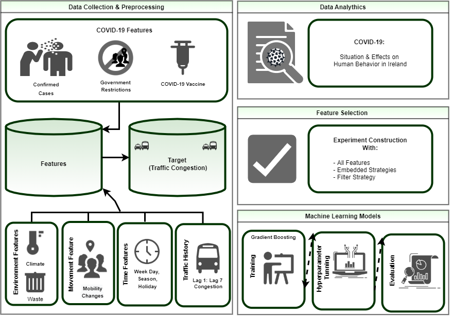

# Dublin-Traffic-Congestion-During-the-COVID-19-Pandemic

This repository belongs to the article titled “Dublin Traffic Congestion During the COVID-19 Pandemic” which is under the submission phase. It contains 3 major folders. Data Gathering + Visualization + Understanding contains the data gathering, cleaning, and analyzing data codes written by Python. Figures + Code contains the main figures along with the Python codes. Feature Selection + Model +clean Data contains the final cleaned data along with the model implementation. For using these codes, please cite the article. 
